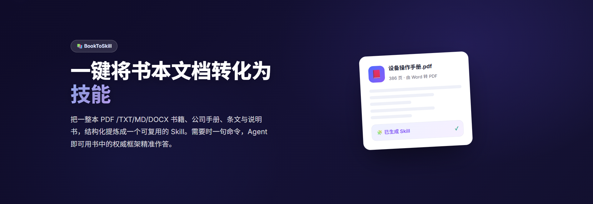

> 将一个或多个 **TXT、Markdown、DOCX 或 PDF** 文件转换为可移植、可安装的 **Skill ZIP**。

Book to Skill 会把源文档转换成自包含的技能包，其中包括基于 JSONL 的知识索引、规范化的源 Markdown、提取的资源、生成的技能指令、Agent
元数据和本地检索辅助程序。构建完成后，Agent 只需调取相关章节或主题即可回答问题，无需在每次提问时重新阅读整本文档。

---

## 项目简介

企业沉淀着大量难以直接使用的知识：由 Word 导出的 PDF、内部手册、规章制度、维修说明书、面试题库等。这些材料普遍面临以下问题：

- **内容分散，检索困难**：数百页的规则和章节集中在一个 PDF 中，只能靠人工翻页查找。
- **层级不清，难以总结**：Word 转 PDF 后常有层级混乱、格式不一等问题，通读成本很高。
- **反复查阅，效率低下**：一线员工、客服和技术人员每天重复翻阅同一批文档。
- **全量查询消耗大量令牌**：不经结构化处理时，每次提问都可能把整本文档放进上下文；数百页文档既慢又贵，还可能超出上下文上限。


Book to Skill 为此而生。它把整本文档整理为带来源依据的可检索知识，之后只需一句命令，就能获得基于文档权威内容的精准回答，而不是让模型凭训练数据猜测。

---

## 为什么需要 Book to Skill

| 不使用 Book to Skill                       | 使用 Book to Skill                  |
|--------------------------------------------|-------------------------------------|
| 整本书直接放入对话，每次提问都重读全部内容 | 生成 Skill 后，按章节或主题精准查找 |
| 数百页文档容易超出上下文上限，令牌成本很高 | 只调取相关内容，显著降低令牌成本    |
| 响应慢、使用成本高                         | 响应更快，且答案有来源依据          |
| 知识被困在 PDF 或文档中                    | 知识变成可复用、可随时调用的能力    |

---

## 核心特性

- 📥 **多格式接入**：一次批量支持 `.txt`、`.md`、`.docx` 和 `.pdf`。
- 📚 **完整保留原始材料**：生成规范化 Markdown，保留 DOCX/PDF 提取的资源；本地转换时，无可用文字层的 PDF 页面会按页保留为图片。
- 🧩 **有界结构化提炼**：按标题上下文切分文本块，组合成有界批次，并以源单元 ID 生成有来源依据的 JSONL 知识索引。
- 🎯 **按需精准取用**：生成的技能先检索有限数量的索引行，再打开必要的 Markdown 或资源，避免全量加载文档。
- 🪙 **节省令牌并可恢复**：相邻小节会合并处理，完成的批次可复用；模型只引用源单元 ID，最终内容由脚本从原文精确还原。
- 🔎 **可选在线 OCR**：仅在明确启用 `--online-ocr` 时，通过 ChatWiki 文档解析接口处理
  PDF；接口或图片下载失败时会回退为该文档的本地转换。工作流不会调用视觉模型。

---

## 工作原理

### 加工模型

1. **转换**：将所有源文档转换为 Markdown，并保留 DOCX/PDF 资源。
2. **切分**：过大的章节按最多 **5,000 个 Unicode 字符**切分；相邻小章节会组合为有界文本块。
3. **分组**：将文本块组合为模型批次，通常每批不超过 **15,000 个字符**且不超过 **8 个文本块**。
4. **撰写元数据**：模型为每个文本块写入有界的知识点元数据，并引用紧凑的源单元 ID；每个源单元最多 1,000 个 Unicode
   字符，优先保留原始行边界。
5. **校验与合并**：校验批次结构、引用和硬性限制；脚本将被引用的源单元精确还原为最终内容，并确定性合并 JSONL 索引。
6. **打包**：将索引、源 Markdown、资源和检索脚本打包为可安装的 Skill ZIP。

批次协议采用基于行的 `.txt` 格式，以避免嵌套 JSON 转义问题。每个文本块最多生成 12 个知识点，每个批次结果最多 64,000
个字符。最终元数据大纲与索引独立限额：大纲过长时会按各文档知识点数量比例抽样，并在限额允许时为每份有索引内容的文档保留至少一项。

### 三步心智模型

1. **提供一本书或一组文档**：PDF、DOCX、技术手册、产品文档、条文和说明书均可。
2. **自动结构化**：工作流保留原文和资源，同时建立带证据来源的章节级知识索引。
3. **一句命令取用**：Agent 先定位对应主题，再依据文档中的原始材料作答。


---

## 独立使用

以下示例假设当前目录为此技能目录，且 `workspace/input` 已放入输入文件，例如 `001-guide.pdf` 和 `002-notes.md`。

**1. 准备转换、切分和批处理状态：**

```bash
python3 scripts/prepare_workflow.py \
  --input workspace/input \
  --markdown workspace/markdown \
  --assets workspace/assets \
  --chunks workspace/chunks \
  --state workspace/index-state.json \
  --log workspace/doc.log
```

只有在明确选择在线 OCR 时才追加 `--online-ocr`。它读取 `CHATWIKI_APIURL` 和 `CHATWIKI_APIKEY`；未设置 API URL 时会使用固定的
ChatWiki API 地址。在线 OCR 只属于本次技能生成流程，生成的技能不包含文档转换或 OCR 能力。

更新已有技能时，只将新上传的源文档放入 `workspace/input`，并在同一命令中追加
`--existing-skill workspace/existing-skill.zip`。工作流会复用旧包中已验证的 Markdown 和资源，只转换新文档，随后重建完整索引和技能包；已经处理过的
PDF 不会再次提交给在线 OCR。更新时必须保持既有技能名称不变。

**2. 请求下一批：**

```bash
python3 scripts/batch_index.py --next \
  --manifest workspace/chunks/chunks.jsonl \
  --state workspace/index-state.json \
  --parts workspace/index-parts \
  --log workspace/doc.log
```

当返回 `status: pending` 时，依据 [`references/indexing.md`](references/indexing.md) 的约定，在返回的 `part_path`
一次性写入完整的基于行的文本部分。只能整文件写入，不能使用内联 Python、heredoc、Shell 重定向、追加或局部编辑。若
`retry_after_invalid` 为真，请用本轮待处理结果覆盖重试占位文件；重复此步骤，直至返回 `status: complete`。

仅接受有界 `.txt` 批处理协议，旧批处理格式会被忽略。保留完成响应中的 `documents`、`outline` 和 `outline_truncated`
用于创建技能元数据；不要读取完整索引，也不要因有界大纲中缺少某个主题而推断文档不支持该主题。不要直接读取或编辑文本块、清单或工作流状态；批处理迭代器是模型可见文档文本的唯一来源。

**3. 合并已验证批次：**

```bash
python3 scripts/merge_index.py \
  --manifest workspace/chunks/chunks.jsonl \
  --state workspace/index-state.json \
  --parts workspace/index-parts \
  --output workspace/doc-index.jsonl \
  --log workspace/doc.log
```

若合并报告某个批处理部分无效、缺失或仍是重试占位符，请回到上一步，仅重写该部分。若报告工作流状态无效、清单不匹配、源工件缺失或
I/O 错误，应直接处理报告的错误，不能重写批处理部分。不要手动编辑转换后的 Markdown、文本块清单、工作流状态或合并后的索引。

**4. 创建元数据并构建技能：**

只使用保留的完成迭代器数据和 [`references/metadata.md`](references/metadata.md) 中的约定创建
`workspace/skill-metadata.json`。如果 `outline_truncated` 为真，只描述大纲中已代表的主题，不要声称其覆盖完整内容；仅在大纲明确说明边界时填写覆盖范围说明。

```bash
python3 scripts/build_skill.py \
  --index workspace/doc-index.jsonl \
  --metadata workspace/skill-metadata.json \
  --markdown workspace/markdown \
  --assets workspace/assets \
  --zip-out workspace/generate_skill/example-docs.zip \
  --log workspace/doc.log
```

更新时，元数据中的 `name`、`--expected-name` 和 ZIP 文件名都必须使用既有技能的原始名称：

```bash
python3 scripts/build_skill.py \
  --index workspace/doc-index.jsonl \
  --metadata workspace/skill-metadata.json \
  --markdown workspace/markdown \
  --assets workspace/assets \
  --expected-name existing-skill-name \
  --zip-out workspace/generate_skill/existing-skill-name.zip \
  --log workspace/doc.log
```

若构建只因 `workspace/skill-metadata.json` 不通过验证而失败，只修改该文件并重新构建；文档准备、批量索引和索引合并已经验证成功时，无需重复执行。

---

## 输入与命名规则

- **支持的格式**：`.txt`、`.md`、`.docx`、`.pdf`。
- 后端暂存的文件名使用 `001-original.ext`；转换后的 Markdown 为 `001-original.md`。
- **序列前缀**可避免词干相同、后缀不同的输入发生冲突。
- 未使用唯一暂存名称时，转换器会拒绝 Markdown 文件名冲突，而不会覆盖数据。
- **所有源文件都必须成功转换**；部分转换视为任务失败。

---

## 输出结构

```text
example-docs/
├── SKILL.md
├── agents/openai.yaml
├── references/doc-index.jsonl
├── references/markdown/*.md
├── references/assets/**
└── scripts/search_index.py
```

生成的技能会在打开源 Markdown 或资源前，先搜索有界数量的索引行；这样既保留可检查的原始材料，又能控制运行时上下文大小。

---

## 运行时要求

- **Python 3.10+**
- `python-docx`、`pypdf` 和 `Pillow`
- Poppler 的 `pdftoppm`
- 只有启用 `--online-ocr` 时，才需要能访问配置的或默认的 ChatWiki API 地址

---

## 项目结构

```text
.
├── SKILL.md
├── README.md
├── agents/openai.yaml
├── references/
│   ├── indexing.md
│   └── metadata.md
└── scripts/
    ├── prepare_workflow.py
    ├── convert_documents.py
    ├── split_markdown.py
    ├── batch_index.py
    ├── merge_index.py
    ├── build_skill.py
    └── search_index.py
```
